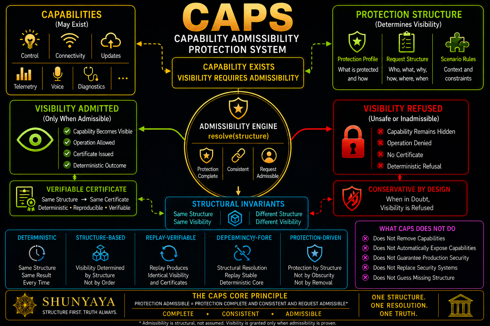

# ⭐ **CAPS**

## **Capability Admissibility Protection System**


`capability_visible iff protection_admissible`

`visibility = resolve(capability, scenario, protection_profile, request_structure)`

---

# 🔍 **Positioning & Scope**

CAPS is a structural demonstration framework rather than a production security library.

It explores whether capability visibility in connected systems and IoT products can be governed through explicit admissibility structure rather than automatic exposure.

CAPS does **not** replace:

- authentication
- encryption
- access control systems
- existing security infrastructure

Instead, CAPS explores a narrower question:

**Can capability remain while visibility becomes structural?**

The demonstrations are intentionally designed to be:

- deterministic
- replayable
- inspectable
- falsifiable

CAPS may be interpreted as a structural visibility layer.

It complements existing:

- security approaches
- access control systems
- capability management approaches

It is not intended to replace them.

---

# ⚡ **What CAPS Demonstrates**

CAPS explores whether **capability existence** and **capability visibility** can be structurally separated.

Modern products continuously accumulate:

- cloud connectivity
- telemetry
- remote access
- firmware updates
- automation
- integrations
- intelligence layers

The common assumption becomes:

capability growth

↓

visibility growth

↓

exposure growth

CAPS explores a different structural direction.

A capability may exist.

Whether it becomes visible is resolved through:

- protection structure
- request provenance
- deterministic admissibility

CAPS does not remove capabilities.

CAPS explores what structurally governs their admission to visibility.

---

# 🚀 **The Core Insight (30 Seconds)**

**Traditional direction**

capability → visibility → security controls

**CAPS direction**

capability → protection structure → visibility

CAPS demonstrates:

- `same structure -> same visibility`
- `unsafe request -> blocked visibility`
- `same structure -> same certificate`
- `capability existence != automatic visibility`

**This is not capability reduction.**

**This is capability separation.**

---

# ⚡ **Try CAPS In 30 Seconds**

### Quickstart

```
python demo/CAPS-SmartBulb/caps_smartbulb_v0_11.py --quickstart
```

### Deterministic Replay

```
python demo/CAPS-SmartBulb/caps_smartbulb_v0_11.py --verify
```

### Unsafe Request Demonstration

```
python demo/CAPS-SmartBulb/caps_smartbulb_v0_11.py --scenario local_on --profile balanced --request telemetry_leak --explain
```

Expected observations:

- capability exists
- unsafe visibility collapses
- deterministic replay remains stable
- identical structure preserves identical certificates

---

# 🔥 **Break CAPS (Challenge)**

If capability automatically implies visibility, at least one of these demonstrations should fail.

Demonstrate any of the following:

- `same structure -> different visibility`
- `unsafe request -> admitted visibility`
- `same structure -> different certificate`
- `incomplete protection -> unsafe exposure`
- deterministic replay failure

If any challenge succeeds:

**the CAPS visibility model fails within that demonstrated visibility space**

If none succeed:

**visibility is not fundamentally determined by capability existence within the modeled structure**

---

# 🔬 **Worked Example — Telemetry Leak Refused**

A smart bulb contains telemetry capability.

An unsafe request attempts visibility.

Run:

```
python demo/CAPS-SmartBulb/caps_smartbulb_v0_11.py --scenario local_on --profile balanced --request telemetry_leak --explain
```

Structural resolution:

Capability exists

↓

Unsafe request arrives

↓

Request becomes inconsistent

↓

Admissibility gate closes

↓

Visibility collapses

↓

Deterministic certificate preserved

Telemetry capability persists.

Visibility is refused.

This is the CAPS demonstration.

---

# 🧩 **Structural Vocabulary**

| Symbol | Meaning |
|---|---|
| `capability` | existing functionality |
| `visibility` | admitted capability surface |
| `protection_admissible` | protection and request structures valid |
| `resolve(...)` | deterministic visibility resolution |
| `VISIBLE` | admitted capability |
| `ISOLATED` | capability visible under isolation |
| `DORMANT` | capability exists but inactive |
| `FORBIDDEN` | capability not admitted |
| `BLOCKED` | capability refused |
| `certificate` | deterministic visibility fingerprint |

---

# 🧪 **Visibility States**

| Protection State | Visibility State |
|---|---|
| complete + consistent | visibility admitted |
| incomplete protection | blocked visibility |
| inconsistent protection | blocked visibility |
| invalid request provenance | blocked visibility |
| unsafe request | blocked visibility |

---

# 🧱 **CAPS Separation Pattern**

| Product Domain | Capability Exists | Visibility Controlled By |
|---|---:|---|
| Door Locks | yes | protection structure |
| Cameras | yes | protection structure |
| Printers | yes | protection structure |
| Routers | yes | protection structure |
| Vehicles | yes | protection structure |
| Appliances | yes | protection structure |
| AI Agents | yes | protection structure |
| IoT Ecosystems | yes | protection structure |

The capability changes.

The product changes.

The visibility surface changes.

**The structural invariant remains unchanged.**

---

# 🔍 **Repository Demonstrations**

Current:

- CAPS-SmartBulb — reference implementation

Planned:

- CAPS-DoorLock
- CAPS-Printer
- CAPS-Camera
- CAPS-Vehicle
- CAPS-IoT
- CAPS-Refrigerator
- CAPS-Speaker
- CAPS-Router

Future demonstrations are expected to reuse shared structural resolution, deterministic replay verification, certificate generation, and a shared `caps-core`.

---

## Reference Demonstration

### CAPS-SmartBulb

Reference implementation demonstrating structural capability visibility using a smart bulb capability surface.

- [CAPS-SmartBulb Folder](demo/CAPS-SmartBulb/)
- [SmartBulb README](demo/CAPS-SmartBulb/README.md)
- [SmartBulb Script](demo/CAPS-SmartBulb/caps_smartbulb_v0_11.py)

Example:

```
python demo/CAPS-SmartBulb/caps_smartbulb_v0_11.py --quickstart
```

---

# 🧠 **Structural Visibility Principle**

CAPS separates:

**capability**

from

**visibility**

Core invariants:

`capability != visibility`

`visibility = admissibility`

`capability_visible iff protection_admissible`

Structural consequences:

- incomplete protection -> blocked visibility
- unsafe request -> blocked visibility
- same structure -> same visibility
- same structure -> same certificate

Capabilities may persist.

Visibility may be refused.

---

# 🧭 **Architecture**



CAPS explores capability visibility as an additional structural layer inside a broader dependency elimination ecosystem.

The focus is not capability removal.

The focus is structural admission of visibility.

---

# 🔍 **Positioning**

| Concept | Primary Focus | Typical Mechanism |
|---|---|---|
| PoLP | permission scope | access rules |
| ASR | exposure reduction | configuration |
| Capability Security | authority delegation | capability references |
| Zero Trust | access decisions | identity + policy |
| **CAPS** | **capability visibility** | **structural admissibility** |

CAPS explores:

**Can visibility become structurally governed?**

---

# 🧱 **Shunyaya Lineage**

CAPS is a capability visibility realization within the broader structural mathematics ecosystem.

CAPS explores a narrower question:

**Can capability remain while visibility becomes structural?**

Core invariant:

`phi((m,a,s)) = m`

CAPS mapping:

| Structural Component | CAPS Interpretation |
|---|---|
| `m` | capability existence |
| `a` | protection admissibility |
| `s` | scenarios + profiles + provenance |
| `resolve(...)` | visibility realization |

---

# 🛡 **Safety Boundaries**

These demonstrations apply within the bounded structural model implemented by each CAPS demonstration.

These demonstrations ARE:

- deterministic demonstrations
- structural visibility demonstrations
- replayable demonstrations

These demonstrations are **NOT**

- production security guarantees
- replacement for security controls
- certification frameworks

Boundaries matter.

Structural refusal is not failure.

Absence is valid output.

No forced visibility is valid output.

---

# 📂 **Documentation**

- [Quickstart](docs/Quickstart.md)
- [FAQ](docs/FAQ.md)
- [Proof Sketch](docs/Proof-Sketch.md)
- [Architecture Notes](docs/CAPS-Architecture-Notes.md)
- [CAPS Challenge](docs/CAPS-Challenge.md)
- [Visibility Scenario Examples](docs/CAPS-Visibility-Scenario-Examples.md)

---

## 🌐 **Ecosystem Context**

CAPS is a capability visibility direction within the broader dependency elimination ecosystem.

The materials below provide broader architectural context and explain where CAPS fits within the larger structural stack.

These materials are provided for ecosystem positioning and are **not CAPS-specific guarantees or claims.**

### Dependency Elimination Framework

[Dependency Elimination Framework](docs/Dependency-Elimination-Framework.png)

Illustrates the broader structural elimination philosophy across domains and the principle that removing non-fundamental dependencies may preserve structural outcomes.

### Shunyaya Structural Stack

[Shunyaya Structural Stack](docs/Shunyaya-Structural-Stack.png)

Illustrates broader ecosystem positioning and shows CAPS as the capability visibility layer within the larger structural stack.

---

# 📜 **License**

See: [LICENSE](LICENSE)

### **Reference Implementations (This Repository):**

These CAPS reference implementation demonstrations are released under the **Open Standard Reference License** —

free to use, study, implement, extend, and deploy.

---

### **Architecture and Documentation:**

Licensed under CC BY-NC 4.0


---

# 🧭 **Roadmap**

Near-term:

- additional product demonstrations
- shared `caps-core`
- stronger replay tooling
- stronger verification

Long-term:

- broader capability ecosystems
- larger visibility demonstrations
- stronger deterministic tooling

CAPS evolves through:

demonstration

↓

verification

↓

structural inspection

---

# ⭐ **Final Line**

Capability may persist.

Visibility is admitted.

`same structure -> same visibility -> same certificate`

**Structure first. Truth always.**
